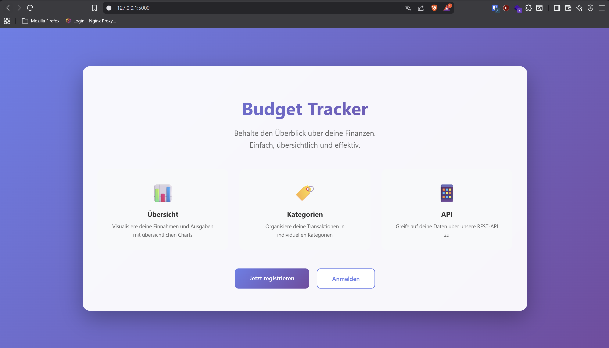
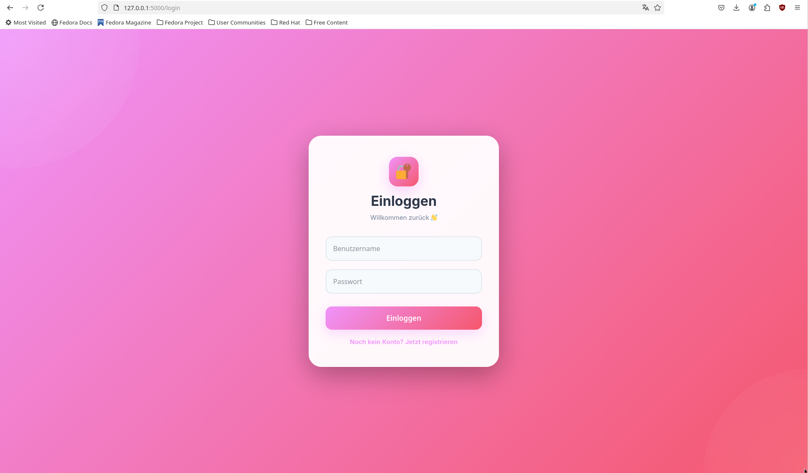
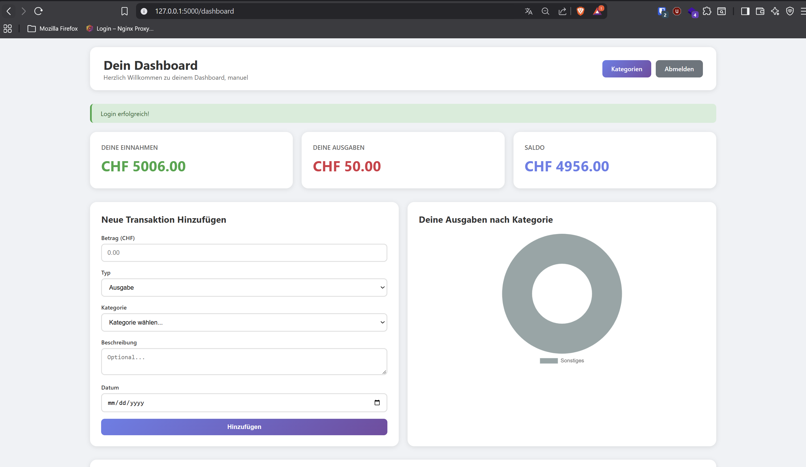

#  Budget Tracker – Flask & MySQL

Eine Webanwendung zur Verwaltung persönlicher Finanzen, entwickelt mit Python (Flask) und MySQL.


---

##  Schnellstart (Lokale Installation)

Folge diesen 6 Schritten, um die App auf deinem Rechner zum Laufen zu bringen.

### Was du vorher brauchst

| Software | Version | Download |
|----------|---------|----------|
| Python | 3.9 oder höher | [python.org/downloads](https://www.python.org/downloads/) |
| MySQL Server | 8.0 oder höher | [dev.mysql.com/downloads](https://dev.mysql.com/downloads/) |
| Git | beliebig | [git-scm.com](https://git-scm.com/downloads) |

> **Wichtig:** Stelle sicher, dass MySQL läuft, bevor du weitermachst. Merke dir den **Benutzernamen** und das **Passwort**, das du bei der MySQL-Installation vergeben hast – du brauchst es in Schritt 4.

---

### Schritt 1 – Repository klonen

Öffne ein Terminal (oder die Eingabeaufforderung unter Windows) und führe aus:

```bash
git clone https://github.com/zerosploit-0/Budget-Tracker-Flask-MySQL-.git
cd Budget-Tracker-Flask-MySQL-
```

---

### Schritt 2 – Virtuelle Umgebung erstellen und aktivieren

Eine virtuelle Umgebung sorgt dafür, dass die Pakete dieses Projekts nicht mit anderen Python-Projekten kollidieren.

**Windows (CMD oder PowerShell):**
```bash
python -m venv venv
venv\Scripts\activate
```

**macOS / Linux:**
```bash
python3 -m venv venv
source venv/bin/activate
```

> Nach der Aktivierung siehst du `(venv)` am Anfang deiner Terminal-Zeile. Das bedeutet, die virtuelle Umgebung ist aktiv.

---

### Schritt 3 – Python-Abhängigkeiten installieren

```bash
pip install -r requirements.txt
```

Dieser Befehl installiert alle benötigten Python-Pakete (Flask, mysql-connector-python, Werkzeug etc.).

---

### Schritt 4 – Datenbank-Zugangsdaten konfigurieren

Öffne die Datei **`db_config.py`** in einem Texteditor und passe die Zugangsdaten an **deine lokale MySQL-Installation** an:

```python
def get_db_connection():
    return mysql.connector.connect(
        host="localhost",
        user="DEIN_MYSQL_BENUTZER",       # z.B. "root"
        password="DEIN_MYSQL_PASSWORT",    # das Passwort, das du bei der MySQL-Installation gewählt hast
        database="budget_tracker"
    )
```

**Beispiel:** Wenn du bei der MySQL-Installation den Benutzer `root` mit dem Passwort `meinsicheresPW` gewählt hast:

```python
        user="root",
        password="meinsicheresPW",
```

> **Tipp:** Wenn du nicht weisst, welchen Benutzernamen/Passwort du hast, öffne die MySQL-Konsole mit `mysql -u root -p` und probiere es aus.

---

### Schritt 5 – Datenbank einrichten mit `setup_db.py`

Das Skript **`setup_db.py`** erstellt automatisch die Datenbank und alle nötigen Tabellen. Du musst die Datenbank **nicht** manuell in MySQL anlegen – das Skript übernimmt alles für dich.

```bash
python setup_db.py
```

**Was passiert dabei im Detail?**

1. Das Skript verbindet sich mit deinem lokalen MySQL-Server (mit den Zugangsdaten aus `db_config.py`).
2. Es erstellt die Datenbank **`budget_tracker`**, falls sie noch nicht existiert.
3. Es erstellt zwei Tabellen:
   - **`users`** – speichert Benutzerkonten (Benutzername, E-Mail, gehashtes Passwort)
   - **`transactions`** – speichert alle Einnahmen und Ausgaben (Betrag, Typ, Kategorie, Datum, Beschreibung)

**Erwartete Ausgabe bei Erfolg:**
```
Database and tables created successfully!
```

**Fehlerbehebung:**

| Fehlermeldung | Ursache | Lösung |
|---------------|---------|--------|
| `Access denied for user ...` | Falscher Benutzername oder Passwort | Prüfe die Zugangsdaten in `db_config.py` (Schritt 4) |
| `Can't connect to MySQL server` | MySQL-Server läuft nicht | Starte MySQL – siehe Abschnitt „MySQL starten" weiter unten |
| `ModuleNotFoundError: mysql` | Python-Pakete fehlen | Führe `pip install -r requirements.txt` nochmal aus (Schritt 3) |

**MySQL starten, falls der Server nicht läuft:**

```bash
# Windows
net start MySQL80

# macOS
brew services start mysql

# Linux
sudo systemctl start mysql
```

---

### Schritt 6 – App starten

```bash
python app.py
```

Öffne danach deinen Browser und gehe zu:

** [http://127.0.0.1:5000](http://127.0.0.1:5000)**

Fertig! Die App läuft jetzt lokal auf deinem Rechner.

---

##  So benutzt du die App

1. **Registrieren** – Erstelle ein Konto unter [/register](http://127.0.0.1:5000/register)
2. **Einloggen** – Melde dich an unter [/login](http://127.0.0.1:5000/login)
3. **Dashboard** – Nach dem Login siehst du dein persönliches Dashboard mit Charts und Statistiken
4. **Transaktionen hinzufügen** – Erfasse Einnahmen und Ausgaben direkt im Dashboard

---

##  Screenshots

### Landing Page


### Login


### Dashboard


---

##  Projektstruktur

```
Budget-Tracker-Flask-MySQL-/
├── app.py              # Hauptanwendung – alle Flask-Routen und Logik
├── db_config.py        # Datenbank-Zugangsdaten (hier anpassen!)
├── setup_db.py         # Erstellt Datenbank + Tabellen (einmal ausführen)
├── requirements.txt    # Liste aller Python-Abhängigkeiten
├── templates/          # HTML-Seiten (Jinja2-Templates)
│   ├── index.html      # Startseite / Landing Page
│   ├── login.html      # Login-Formular
│   ├── register.html   # Registrierung
│   └── dashboard.html  # Dashboard mit Charts
└── README.md           # Diese Datei
```

---

##  REST-API

Die App bietet auch eine JSON-API für externen Zugriff (z.B. mit Postman oder curl).

| Methode | Endpunkt | Beschreibung |
|---------|----------|--------------|
| `POST` | `/api/register` | Neuen Benutzer anlegen |
| `POST` | `/api/login` | Einloggen |
| `GET` | `/api/transactions` | Alle Transaktionen abrufen (Login nötig) |
| `POST` | `/api/transactions` | Neue Transaktion hinzufügen (Login nötig) |

**Beispiel mit curl:**

```bash
# 1. Registrieren
curl -X POST http://127.0.0.1:5000/api/register \
  -H "Content-Type: application/json" \
  -d '{"username": "test", "password": "test123"}'

# 2. Einloggen (Session-Cookie speichern)
curl -X POST http://127.0.0.1:5000/api/login \
  -H "Content-Type: application/json" \
  -d '{"username": "test", "password": "test123"}' \
  -c cookies.txt

# 3. Transaktionen abrufen
curl -X GET http://127.0.0.1:5000/api/transactions \
  -b cookies.txt
```

---

##  Technologie-Stack

| Bereich | Technologie |
|---------|-------------|
| Backend | Python 3.9+, Flask 3.0, Werkzeug (Passwort-Hashing) |
| Datenbank | MySQL 8.0+ (oder MariaDB) |
| Frontend | HTML5, CSS3, Jinja2-Templates, Chart.js |

---

## 🔒 Sicherheitshinweis

Für den **produktiven Einsatz** sollte der Secret Key in `app.py` geändert werden:

```bash
python -c "import secrets; print(secrets.token_hex(32))"
```

Den generierten Wert dann in `app.py` bei `app.secret_key` einsetzen.

---

##  Projektkontext

Dieses Projekt wurde als Praxisarbeit im Modul **Datenbanken und Webentwicklung (DBWE)** an der **IFA** entwickelt.

---

##  Autor

**zerosploit-0** – [@zerosploit-0](https://github.com/zerosploit-0)
